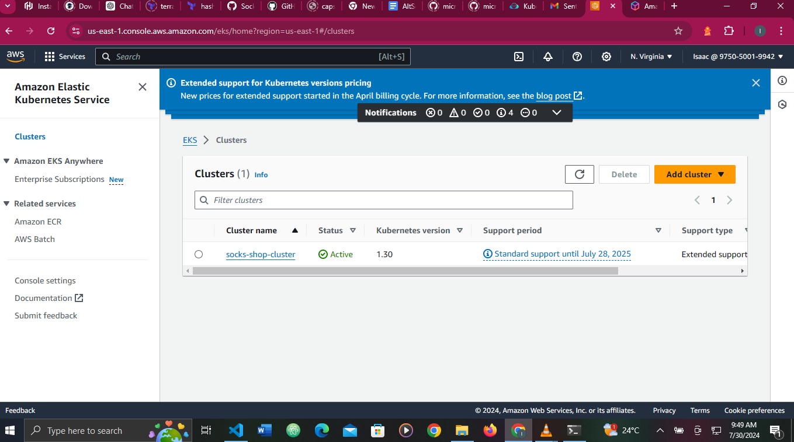

# Capstone-project
## Overview  
Deploying a microservices-based architecture application on Kubernetes using a clear IaaC (Infrastructure as Code) deployment to be able to deploy the services in a fast manner.  
## Getting started 

### Step 1: Infrastructure Provisioning
Using Terraform, necessary resources such as VPCs, subnets, S3 buckets, security groups and an EKS cluster will be provisioned using terraform 
1. Create a new directory and clone this repo in it 
  ~~~  
  git clone https://github.com/Isaac247/capstone-project.git
  ~~~
2. Move to the terraform folder and initialize terraform
  ~~~
  cd terraform/
  terraform init
  ~~~
3. Run the terraform validate and execution plan to check for errors as well as creating an execution plan
  ~~~
  terraform validate  
  terraform plan
  ~~~
4. Run the terraform apply command
  ~~~
  terraform apply --auto-approve
  ~~~   


  
creation process of the EKS cluster  


EKS cluster created successfullly  

### Step 2: Deploying manifest file to the EKS cluster created  
1. Move to kubernetes directory 
 ```
 cd kubernetes/
 ```
2. Configure Kubectl to connect to the Eks cluster 
 ```
 aws eks update-kubeconfig -name=socks-shop-cluster --region=us-east-2
 ```  
 
3. Apply deployment manifest file to the EKS cluster just created
 ```
 kubectl apply -f socks_shop_deployment.yaml
 ```  
4. After deployment is successful, create a new name space called "sock-shop" because the manifest was deployed there   

5. Run this commands to get the pods and services runing on the Eks cluster
 ```
 kubectl get pods
 kubectl get svc
 ```
 
  
